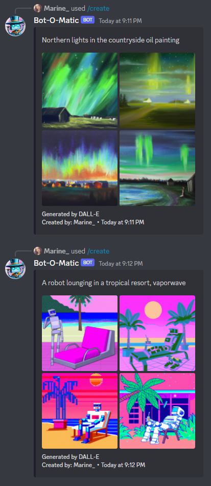
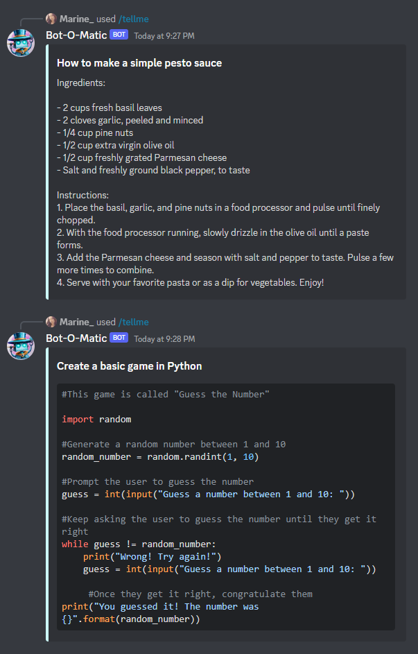

# Bot-O-Matic

## Table of contents
* [Description](#description)
* [Notes](#notes)
* [Commands](#commands)
    - [Generate Images with DALL-E](#generate-images-with-dall-e)
    - [Generate Text with ChatGPT](#generate-text-with-chatgpt)
* [Setup Guide](#setup-guide)
* [Next Steps](#next-steps)


## Description

Bot-O-Matic is a Discord Bot powered by AI to generate text, code examples and images based on user input.

This bot uses [Discord.js](https://discord.js.org/#/) and [OpenAI's API](https://openai.com/api/). It employs **DALL-E** to create images based on a prompt and the **text-davinci-003 model** to generate text and code responses.

## Notes
This application was designed to run on a private server and is still in development. More commands will be added to it in the near future.

## Commands

### Generate Images with DALL-E

```
/create
```

Generate **4 images** based on the prompt given by the user.
Images have a size of **1024x1024 pixels** and can be downloaded as **.png** images.



### Generate Text with ChatGPT

```
/tellme
```

Generate a text response based on the user input.

A **block of code** will be displayed and **highlighted** according to the programming or style language specified by the user.
Current languages supported: Javascript, Python, C#, C++, CSS.




## Setup Guide
1. Create a **config.json file** and fill the following environment variables as detailed below:

```
"token": "YOUR_SECRET_TOKEN",
"clientId": "YOUR_CLIENT_ID",
"OPENAI_API_KEY":"YOUR_OPENAI_API_KEY"
```

2. Go to [OpenAI's website](https://beta.openai.com/account/api-keys), create a new API key, and add your **OPENAI_API_KEY**.
3. Create your own [Discord bot/application](https://discord.com/developers/applications).
4. Go to the Bot tab, fill in your **DISCORD_BOT_TOKEN** and disable **Public Bot** unless you want your bot to be visible to everyone.
5. Go to the OAuth2 tab, copy your "Client ID", and fill in **DISCORD_CLIENT_ID**.
6. Add the bot to your server:
    - Go to the **OAuth2 tab**, and then go to the **URL Generator** tab
    - Pick **'bot'** in the **scopes** list
    - Select at least the following permissions:
        - Send Messages
        - Send Messages in Threads
        - Create Public Threads
        - Manage Messages (only for moderation to delete blocked messages)
        - Manage Threads
        - Read Message History
        - Use Application Commands
7. Install dependencies, deploy the commands and run the bot:

```
npm install
node deploy-commands.js
node index.js
```


## Next Steps
* Add a button to make variations for a selected image.
* Store the images selected by the user.
* Remove basic commands (/ping, /user, /server) and replace the other ones (/cat, /echo).
* Implement the /help command to see all the commands.